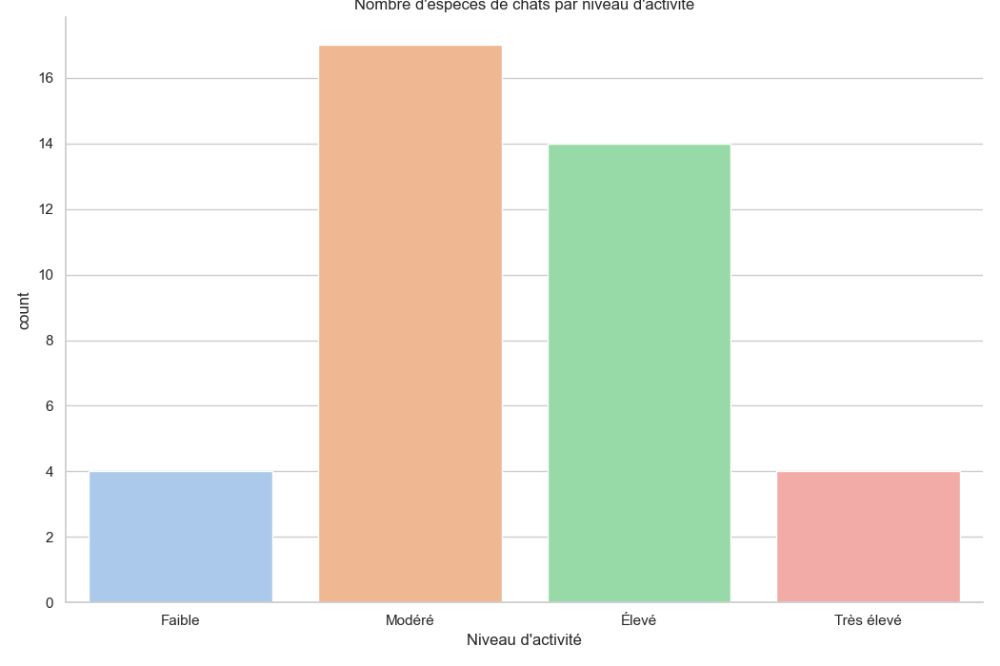
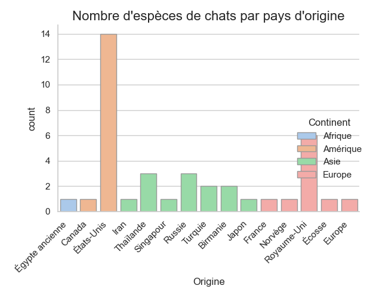
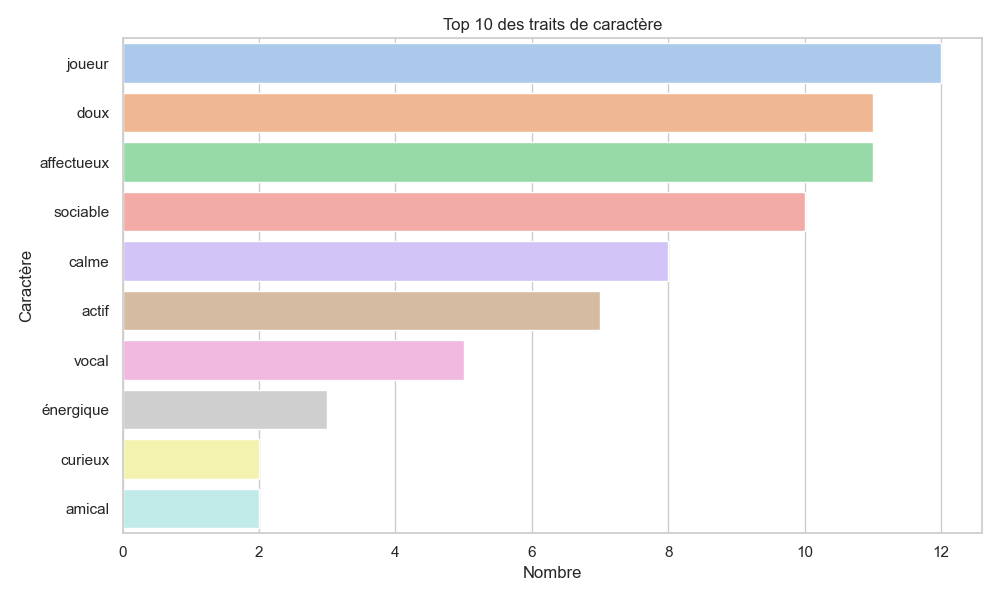

# Web Scraping — Races de chats

Projet de web scraping et d'analyse de données en Python : extraction des caractéristiques
et photos de **39 races de chats** depuis [zoologiste.com](https://www.zoologiste.com/chats/),
suivie d'un nettoyage et d'une exploration visuelle du jeu de données obtenu.

## Aperçu des résultats

| Niveau d'activité | Répartition par pays d'origine | Top des traits de caractère |
|---|---|---|
|  |  |  |

D'autres graphiques (répartition des poids, de l'espérance de vie, de la santé) sont disponibles
dans le dossier [`figures/`](figures/) et commentés dans le [notebook](notebooks/graphique.ipynb).

## Structure du projet

```
.
├── src/
│   ├── zoologiste.py       # Scraping : caractéristiques + photos des races de chats
│   └── graphique.py        # Nettoyage des données et génération des graphiques
├── notebooks/
│   └── graphique.ipynb     # Version notebook, commentée, de l'analyse
├── data/
│   ├── chats_dataset.csv   # Jeu de données d'exemple déjà scrappé (39 races)
│   └── raw/                # Pages HTML brutes du scraping — généré, non versionné
├── figures/                # Graphiques générés par src/graphique.py
├── pictures/               # Photos des races scrappées par src/zoologiste.py — non versionné
├── tables/                 # Statistiques descriptives exportées — non versionné
├── requirements.txt
└── LICENSE
```

## Démarche

1. **Scraping (`src/zoologiste.py`)**
   - Récupération de la page listant les races de chats, puis de chaque page individuelle.
   - Extraction des caractéristiques (origine, caractère, taille, poids, espérance de vie, etc.)
     par expressions régulières, et de la photo principale de chaque race via BeautifulSoup.
   - Résultat exporté dans `chats_dataset.csv`.
2. **Nettoyage & analyse (`src/graphique.py` / `notebooks/graphique.ipynb`)**
   - Découpage des colonnes texte (poids, espérance de vie) en valeurs numériques min/max.
   - Regroupement des pays d'origine par continent.
   - Statistiques descriptives exportées en `.xlsx`.
   - Visualisations avec `seaborn`/`matplotlib` : niveau d'activité, origine géographique,
     santé, répartition des poids et de l'espérance de vie, traits de caractère les plus fréquents.

## Installation

```bash
git clone https://github.com/Marius-cld/Web-Scraping-Zoologist.git
cd Web-Scraping
python3 -m venv venv && source venv/bin/activate
pip install -r requirements.txt
```

## Utilisation

Un jeu de données d'exemple (`data/chats_dataset.csv`) est déjà fourni : pas besoin de relancer
le scraping pour explorer l'analyse.

```bash
# (Optionnel) Relancer le scraping pour régénérer data/chats_dataset.csv
python3 src/zoologiste.py

# Nettoyer les données et générer les graphiques
python3 src/graphique.py
```

Le notebook [`notebooks/graphique.ipynb`](notebooks/graphique.ipynb) présente la même analyse de façon narrative,
avec les graphiques déjà générés — pratique pour parcourir le projet directement sur GitHub.

## Technologies

`requests` · `BeautifulSoup` · `pandas` · `numpy` · `seaborn` / `matplotlib` · `openpyxl`

## Remarque

Projet réalisé à des fins d'apprentissage et de démonstration (portfolio). Le scraping respecte
un `User-Agent` explicite et des délais raisonnables ; merci de rester respectueux du site source
si vous relancez les scripts.

## Licence

Distribué sous licence [MIT](LICENSE).
